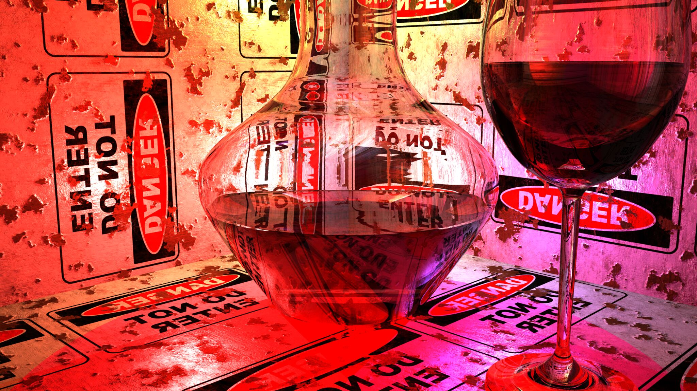
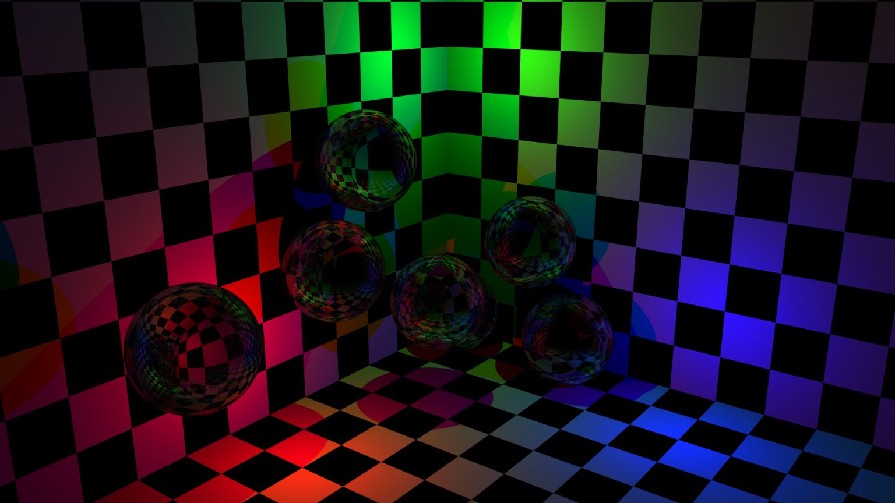
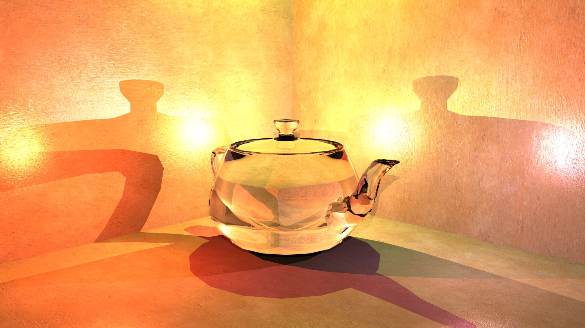
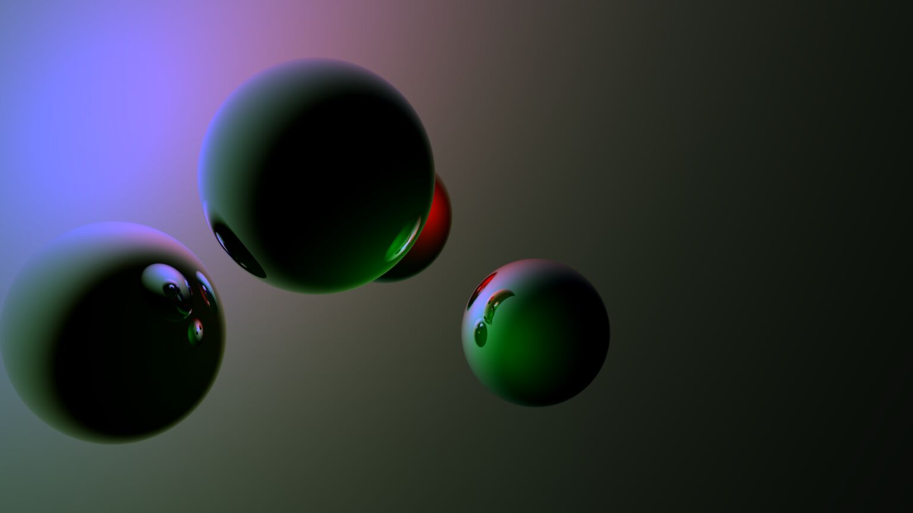
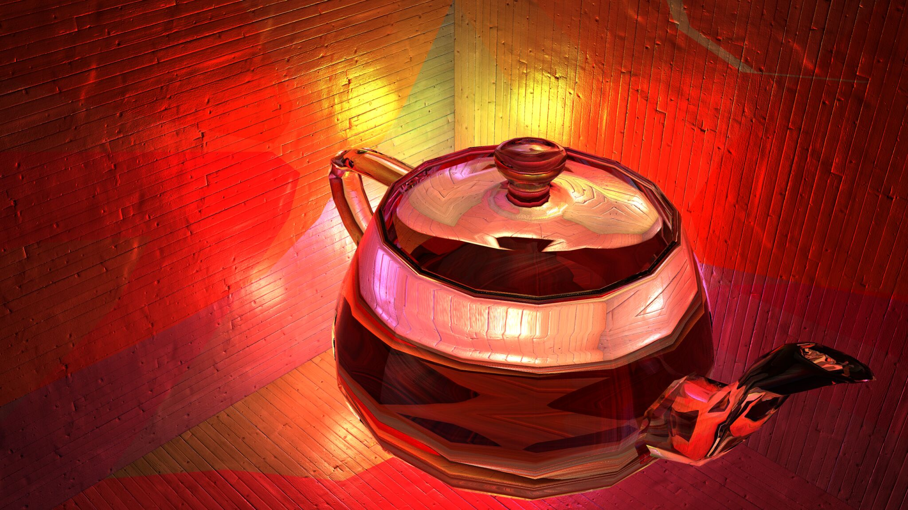

rustray
=======

The rustray project is a pure-rust ray tracer. It is capable of optimizing
material-related computions, by using highly composable material building
blocks.

Usage
-----

Currently, rustray virtual 3d scenes can only be constructed by a user
program. Implementing a simple scene format is on the todo list.

To see the built-in demo scene render, run:

```shell
# note: --release is important!
# ray tracing is *painfully slow* in debug mode
cargo run --release
```

If this is your first time running rustray, some Creative Commons textures will
be downloaded from `ambientcg.com`. These will be cached for future runs.

After rustray has run, take a look at `output.png`

```shell
xdg-open output.png
```

Principles
----------

The main starting point for rustray is the `Tracer`. It is supplied with:

 - A virtual camera (`Camera<F>`)
 - A list of objects in the scene (`RayTarget<F>`)
 - A list of lights (`Light<F>`)

like so:

```rust
let tracer = tracer::Tracer::new(
    camera,
    objects,
    lights,
);
```

After this setup, the tracer is ready to generate output:

```rust
// for example, render whole image:
let img = ...;
let output = tracer.render_image(&img);

// or, render specific line:
let y = ...;
let line = tracer.generate_span(y);
```

See `src/main.rs` for a practical example.

Demo images
-----------

Glassy material, demonstrating Fresnel behavior.



Untextured glass spheres, demonstrating Fresnel behavior. Index of refraction is
set much higher than real glass, to get a more metallic reflective surface.



Glassy-metallic material showing refraction and reflection.


Utah Teapot made from glass.



Classic shiny spheres.



Experimental test of colored shadow material. This proof-of-concept material
casts red shadows. Since the main material (teapot) is transparent, this is of
course highly unrealistic, but is demonstrates the possibility.


