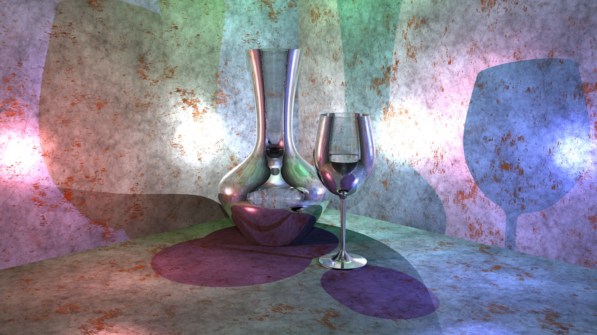

rustray
=======

The rustray project is a pure-rust ray tracer. It is capable of optimizing
material-related computions, by using highly composable material building
blocks.

Usage
-----

Currently, rustray virtual 3d scenes can only be constructed by a user
program. Implementing a simple scene format is on the todo list.

To see the built-in demo scene render, run:

```shell
# note: --release is important!
# ray tracing is *painfully slow* in debug mode
cargo run --release
```

If this is your first time running rustray, some Creative Commons textures will
be downloaded from `ambientcg.com`. These will be cached for future runs.

After rustray has run, take a look at `output.png`

```shell
xdg-open output.png
```

Programming rustray scenes
==========================

Basic types
-----------

All of rustray features user-selectable floating-point number type. This is
reflected in the api, with names such as `Point<F>`, `Vector<F>`, `Color<F>`,
etc.

The `<F>` in these type names have to implement the `Float` trait. This trait is
already implemented for the standard `f32` and `f64` types.

Tracer
------

The main starting point for rustray is the `Tracer`. It is supplied with:

 - A virtual camera (`Camera<F>`)
 - A list of objects in the scene (`Geometry<F>`)
 - A list of lights (`Light<F>`)

like so:

```rust
let tracer = tracer::Tracer::new(
    camera,
    objects,
    lights,
);
```

After this setup, the tracer is ready to generate output. See `src/main.rs` for
a practical example.

Objects
-------

The parameter `objects` is a list of things that all implement `Geometry<F>`

Each `Geometry<F>` can test itself for intersection with a ray. If so, they
return a `Hit<F>` describing the hit point where the intersection took place,
and the direction of the ray.

The next step is to resolve the material properties at this point. In addition
to the intersection point, and ray direction, the `Hit<F>` struct also contains
a `HitTarget<F>` reference.

The `HitTarget<F>` can compute material properties at the hit point, such as
texture coordinates, surface normals, etc. Calling `resolve(...)` returns a
`Maxel<F>` ("Material Pixel").

The `Maxel<F>` depends on the geometry being hit, but is unrelated to the
desired material simulation.

To get a color contribution from a Maxel, we call `render(...)` on the
referenced `Material`.

Thus, the pipeline is `Ray -> Hit -> Maxel -> Color`.

Demo images
-----------

Glassy material, demonstrating Fresnel behavior.


Untextured glass spheres, demonstrating Fresnel behavior. Index of refraction is
set much higher than real glass, to get a more metallic reflective surface.


Glassy-metallic material showing refraction and reflection.



Utah Teapot made from glass.


Classic shiny spheres.


Experimental test of colored shadow material. This proof-of-concept material
casts red shadows. Since the main material (teapot) is transparent, this is of
course highly unrealistic, but is demonstrates the possibility.


